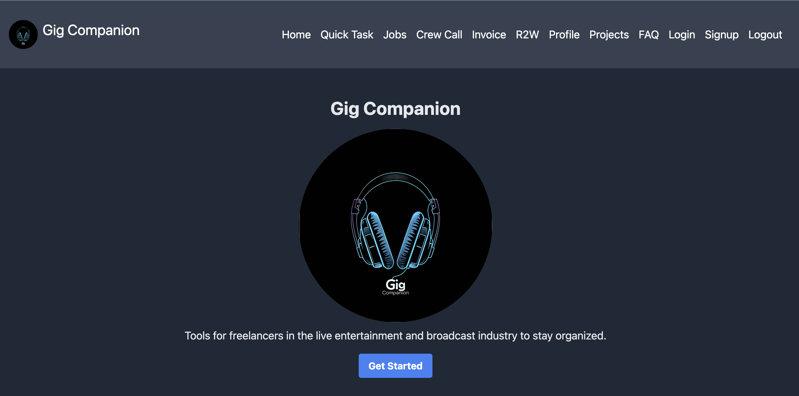
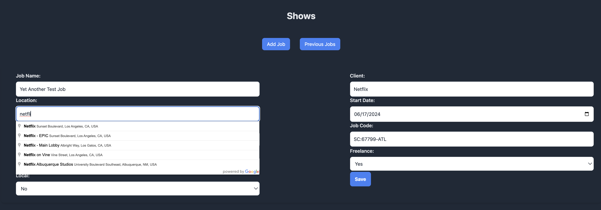
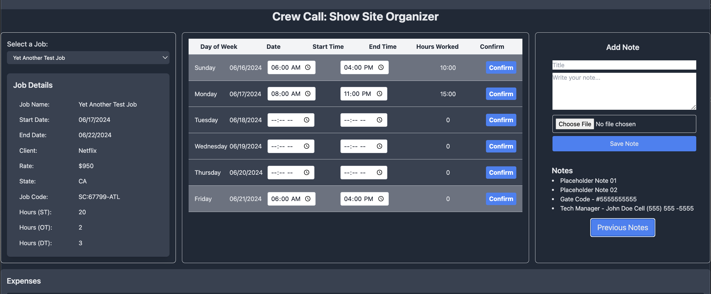

# Entertainment Industry Time & Expense Tracker

## Introduction

I am a solo developer creating an app for my friends and colleagues in the live entertainment and broadcast industry. This app is designed to help professionals track their hours, labor, invoicing, and expenses tied to a job number. Please note that this app is not intended for commercial use by other companies to make money.

I will provide the code as open-source and will try to host it for free or as cheaply as possible for as long as I can.

### Dashboard

## Features

- **Labor Tracking :ledger:**: Automatically track standard rate, overtime, and double time.
- **Expense Tracking :clipboard:**: Log, categorize, and manage expenses.
- **Invoicing :page_facing_up:**: Generate and manage invoices based on logged work hours and expenses.
- **Schedule Management :calendar:**: Keep track of upcoming shows with detailed schedules.
- **Data Security :closed_lock_with_key:**: Google Drive integration planned for local data storage to ensure your data is secure and under your control.

### Jobs Screen

## Made for Show Techs and Project Managers by a Show Tech and PM

### Crewcall Job Tracker

## Milestones

### Successful Implementations

- **User Registration**: Easy sign-up and management of user accounts.
- **Quick Task Tracker**: Allows users to "clock in" and out to record simple tasks like admin time for projects outside of typical work scope.
- **One-Stop Job Adding**: Lets users input job details like job code (showcode for ESPN/Nabet employees), start and end dates, and indicate if the user is a freelance or W2 employee.
- **Google Maps API Integration**: Autofill location details.
- **Local Gig Check**: Automatically marks and tracks travel days if the job is not local.
- **Auto Invoice Filling**: Based on base rate and time card input.
- **Expense Tracker**: Tied to each job, allowing for easy tracking of receipts while on the road.
- **Right to Work Tracker**: Tallies work days in each region to determine if you are in a majority right-to-work state, useful for those who do not wish to join a union.
- **Mobile-Friendly Design**: Most pages are now designed to be mobile-friendly.

### Items Left To Do

- **Sign in with Google & GitHub**: One click sign-on with your Google Account or Github.
- **Complete PM Portal**: Allows PMs to create jobs and assign users, filling out job details including rate automatically.
- **QR Code Storage**: Allow users to store generated QR codes for credentials pickup, eliminating the need to search for old emails.
- **Mail Portal**: Enable users to forward confirmation emails, with the server scraping important data and auto-filling for the user.
- **Google Drive API Integration**: Give users the option to store their data on their own Google Drive instead of our S3 buckets.
- **S3 Bucket Implementation**: Store expense uploads securely.
- **PDF/.xlsx Generator**: Automatically fill out company or union-required expense and invoice forms.
- **Automated Mail System**: Send final invoices and expenses to respective parties directly from the mobile phone, aiding techs with limited access to a computer.
- **Dedicated iOS App**: Plan and develop a dedicated app for iOS users.

## FAQ

### What is this app?

This app is an open-source tool designed to help professionals in the live entertainment and broadcast industry track labor, timecards, expenses, and upcoming shows, all in one place.

### Who is this app for?

The app is designed for freelancers, contractors, and employees in the live entertainment and broadcast industry who need to manage their work hours, expenses, and schedules.

### Is this app free to use?

Yes, the app is free to use. Our goal is to keep it free or as affordable as possible for most users. However, as it grows, we may need to introduce some paid features to support maintenance and development.

### Is my data secure?

Yes, your data security is a top priority. We do not harvest unnecessary data and we plan to implement Google Drive integration to allow users to store their data locally.

### Will my data be stored on your servers?

No, with the planned Google Drive integration, your sensitive work data will not be hosted on our servers. You will have control over your data storage.

### Can I use this app for commercial purposes?

No, the app is open-source and restricted to non-commercial use only.

### How do I track my labor hours?

You can track your labor hours by creating timecards within the app. Each timecard allows you to log clock-in and clock-out times, breaks, and daily durations.

### How can I track my expenses?

The app has a built-in expense tracking feature where you can log your expenses, categorize them, and add descriptions and amounts.

### Can I generate invoices from the app?

Yes, the app offers an invoicing feature that allows you to create and manage invoices based on your logged work hours and expenses.

### How do I keep track of upcoming shows?

You can keep track of upcoming shows by adding them to the app’s schedule feature. You can set dates, locations, and other relevant details.

### Is there a limit to how much data I can store?

There is no specific limit to the data you can store within the app, but it will depend on the storage capacity of your Google Drive if you choose to store data locally.

### How can I back up my data?

With the planned Google Drive integration, you will be able to back up your data to your own Google Drive account.

### Can I collaborate with others using this app?

Currently, the app is designed for individual use. Collaboration features may be considered in future updates.

### What if I encounter a bug or issue?

If you encounter any bugs or issues, you can report them through the app’s support or contact section. As a solo developer, I appreciate your patience and feedback.

### How often is the app updated?

The app is updated as needed. Being a solo developer, I aim to release updates regularly but appreciate your understanding regarding the pace of development.

### Can I contribute to the app’s development?

Yes, since the app is open-source, you can contribute to its development. Contributions are welcome, and you can find the source code and contribution guidelines on the app’s repository.

### Will the app always remain open-source?

Yes, the plan is to keep the app open-source to ensure transparency and community involvement.

### Do I need an internet connection to use the app?

At this time, the app will always require an internet connection.

### How can I provide feedback or suggestions for the app?

You can provide feedback or suggestions through the app’s feedback section or by contacting me directly through the provided support channels.

### What platforms is the app available on?

The app is currently available as a web application. Mobile versions may be considered in the future based on user demand and resources.

## Privacy Policy

At our app, we are committed to protecting your privacy. This Privacy Policy outlines how we collect, use, and safeguard your information.

### Information Collection

We do not harvest or sell your personal data. Any data collected is solely for the purpose of improving your experience and for learning purposes.

### Use of Information

Your information will not be used for any commercial purposes without your consent. We aim to keep the app free and accessible to all users as long as possible.

### Third-Party Services

We do not share your information with third parties for marketing purposes. Any integrations with third-party services will be clearly communicated.

### Changes to This Policy

We reserve the right to update this Privacy Policy as needed. Any changes will be communicated to users in a timely manner.

### Contact Us

If you have any questions about this Privacy Policy, please contact us.

## Contributions

Contributions are welcome! Please read the [CONTRIBUTING](CONTRIBUTING.md) file for guidelines on how to contribute to this project.

## Acknowledgments

Special thanks to all the professionals in the live entertainment and broadcast industry who inspired and supported the development of this app.
